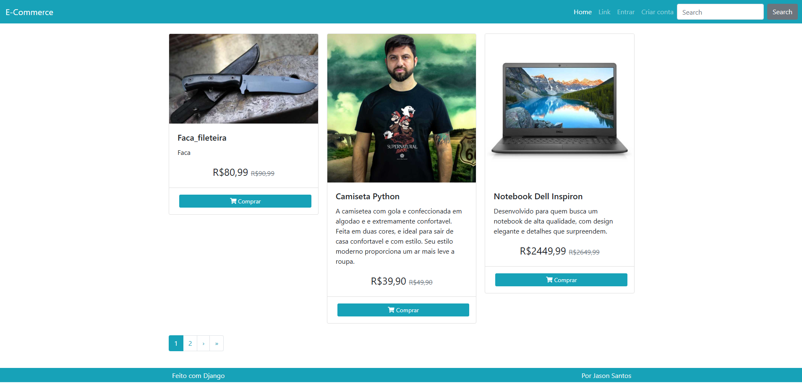
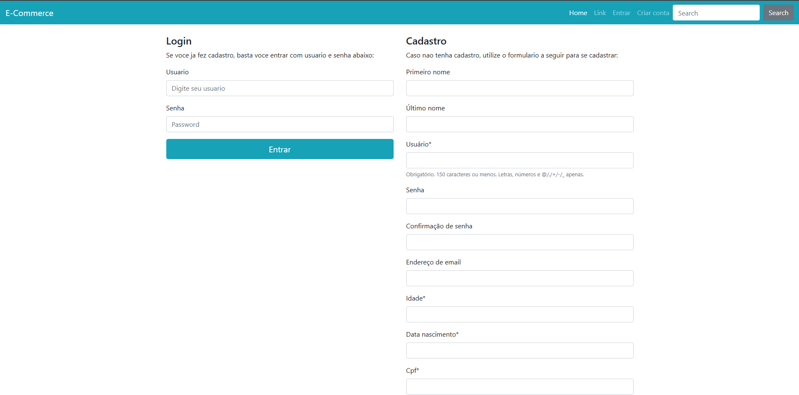
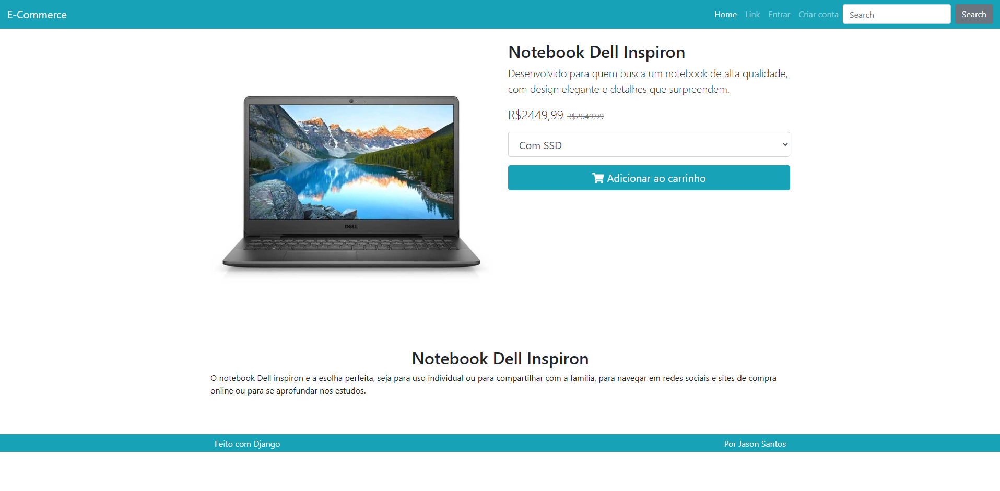
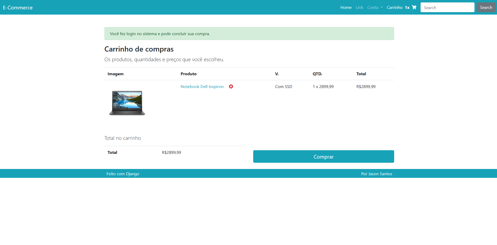
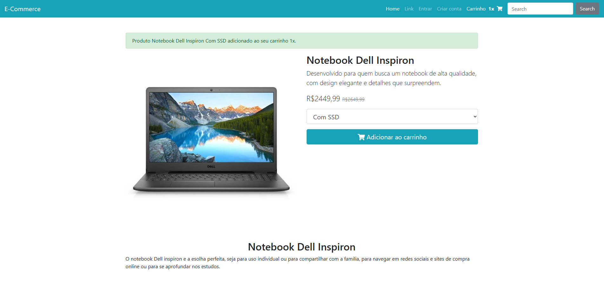
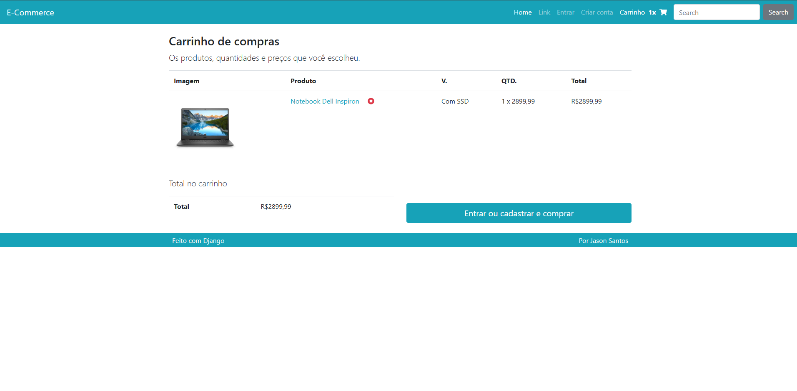
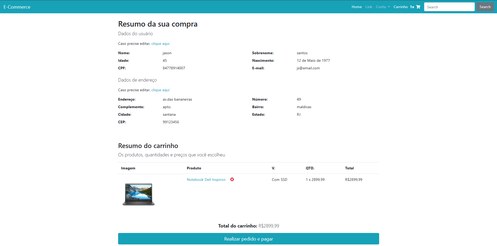

# E-commerce em Django

Projeto desenvolvido no curso **Python 3 do Básico ao Avançado** de [Luiz Otávio Miranda](https://www.udemy.com/user/luiz-otavio-miranda/), implementando um sistema completo de e-commerce com funcionalidades avançadas.

## 🚀 Tecnologias Utilizadas
- **Python 3** e **Django** para backend.
- **SQLite** para banco de dados.
- **Django ORM** para consultas e manipulação de dados.
- Sistema de templates do Django para renderização dinâmica.

## 📂 Estrutura do Projeto
- `core/` – Configuração principal do Django (settings, urls, wsgi).
- `produto/` – App para cadastro e gerenciamento de produtos.
- `pedido/` – App para controle de carrinho e pedidos.
- `perfil/` – App para cadastro, login, logout e gerenciamento de perfis de usuário.
- `templates/` – Templates HTML com integração de contexto dinâmico.

## 🔑 Funcionalidades
- Sistema completo de autenticação (cadastro, login e logout).
- Carrinho de compras persistente por sessão.
- Cálculo automático de valores, frete e descontos.
- Proteção CSRF e boas práticas de segurança do Django.

## 🧠 Profundidade Técnica
- Utilização de **class-based views** e **function-based views**.
- Manipulação de formulários Django Forms e ModelForms.
- Integração de mensagens de feedback com `django.contrib.messages`.
- Validações personalizadas em formulários.
- Deploy pronto para produção (com suporte a arquivos estáticos e configurações seguras).

## Interface
<p align="center">
   
</p>

<p align="center">
   
</p>

<p align="center">
   
</p>

<p align="center">
   
</p>

<p align="center">
   
</p>

<p align="center">
   
</p>

<p align="center">
   
</p>

<p align="center">
   
</p>

## 📦 Instalação e Uso
Clone o repositório e instale as dependências:
```bash
git clone https://github.com/JsnEvt/ecommerce.git
cd ecommerce
python -m venv venv
source venv/bin/activate   # Linux/Mac
venv\Scripts\activate      # Windows
pip install -r requirements.txt
python manage.py runserver
```
Acesse o sistema em: http://localhost:8000

## Licença

MIT License

Copyright (c) 2022 Jason Everton

Permission is hereby granted, free of charge, to any person obtaining a copy
of this software and associated documentation files (the "Software"), to deal
in the Software without restriction, including without limitation the rights
to use, copy, modify, merge, publish, distribute, sublicense, and/or sell
copies of the Software, and to permit persons to whom the Software is
furnished to do so, subject to the following conditions:

The above copyright notice and this permission notice shall be included in all
copies or substantial portions of the Software.

THE SOFTWARE IS PROVIDED "AS IS", WITHOUT WARRANTY OF ANY KIND, EXPRESS OR
IMPLIED, INCLUDING BUT NOT LIMITED TO THE WARRANTIES OF MERCHANTABILITY,
FITNESS FOR A PARTICULAR PURPOSE AND NONINFRINGEMENT. IN NO EVENT SHALL THE
AUTHORS OR COPYRIGHT HOLDERS BE LIABLE FOR ANY CLAIM, DAMAGES OR OTHER
LIABILITY, WHETHER IN AN ACTION OF CONTRACT, TORT OR OTHERWISE, ARISING FROM,
OUT OF OR IN CONNECTION WITH THE SOFTWARE OR THE USE OR OTHER DEALINGS IN THE
SOFTWARE.
